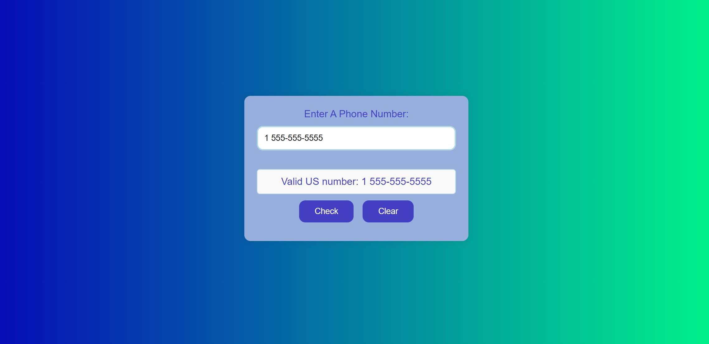

# Telephone-Number-Validator 🚀

## Project Description 📝

>
 This web application validates US phone numbers based on specific formats using regular expressions (regex). It provides instant feedback on whether the entered phone number is valid or not and include this elements:

- Input field (`#user-input`) to enter a phone number.
- Button (`#check-btn`) to validate the entered phone number.
- Button (`#clear-btn`) to clear the results.
- Display area (`#results-div`) to show validation results.

## Validation Rules

The app validates phone numbers based on the following formats:
- `1 555-555-5555`
- `1 (555) 555-5555`
- `5555555555`
- `555-555-5555`
- `(555)555-5555`
- `1(555)555-5555`
  
Any deviation from these formats will result in an "Invalid US number" message.
>

## Demo 📸

life demo link [(https://farwamuhibzada.github.io/Telephone-Number-Validator/)]





## Technologies Used 🛠️

List the technologies or tools that i used to develop this project. 
- HTML
- CSS
- java script


## Installation 💻

for using this project you neet to install 3 things:

- chrombrowser
- an IDE like vscode
- git
- node JS


## Usage 🎯

for using this project you need to know a few commond first clone the repositry in yor local machine then go to the github directory . open the project on your IDE like vscode and start working on it .


go to the cmd and clone the Technical Documentation Page 
using this commond:
```bash

git clone https://github.com/FarwaMuhibZada/Telephone-Number-Validator.git 
```
go to the githu directory:
```bash

cd># Telephone-Number-Validator

```
open the project on your IDE like vscode :

```bash

cd># Telephone-Number-Validator code .

```


## Features ⭐
- Input field (`#user-input`) to enter a phone number.
- Button (`#check-btn`) to validate the entered phone number.
- Button (`#clear-btn`) to clear the results.
- Display area (`#results-div`) to show validation results.

## FarwaMuhibzada 👩‍💻


- LinkedIn: [(https://www.linkedin.com/in/farwa-muhibzada/)]
- Email: [(farwafarid2017@gmail.com)]

## Contributing 🤝
For contribution you can create a pull request and mention me there.Thank you.